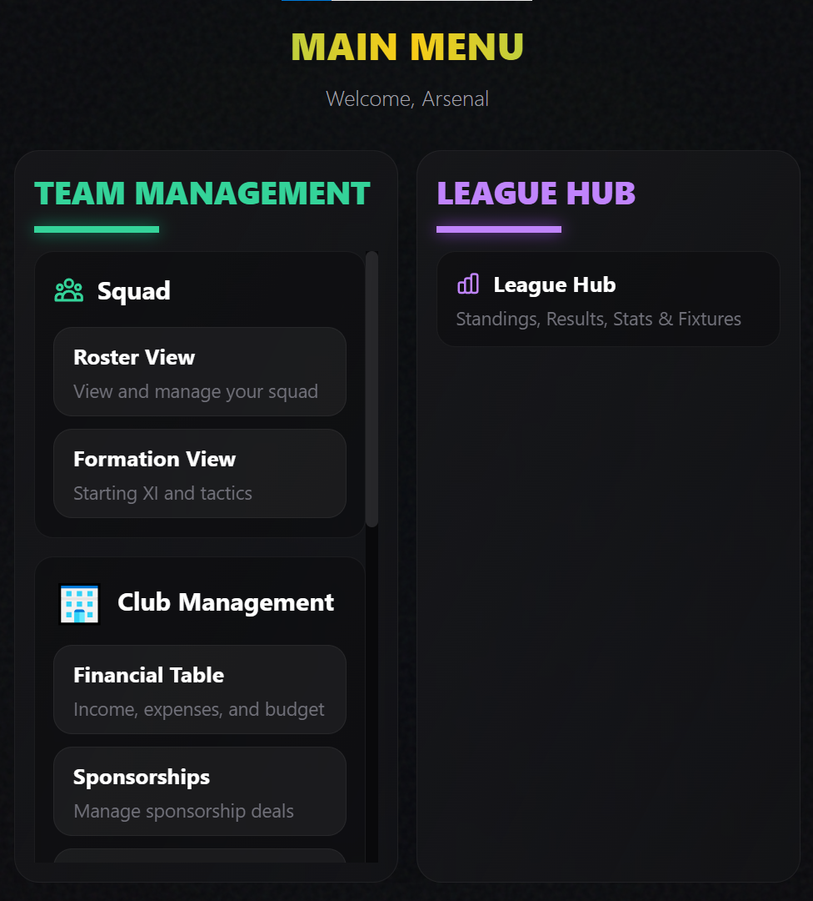
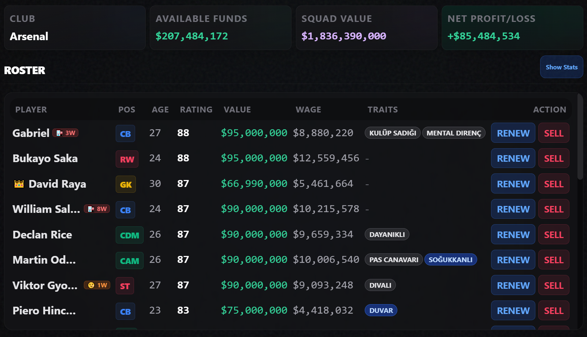
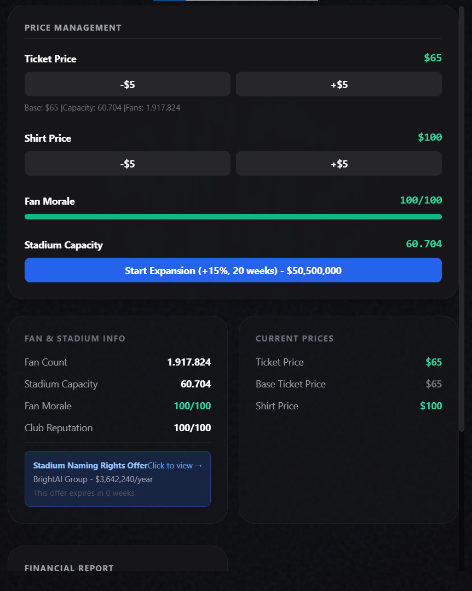
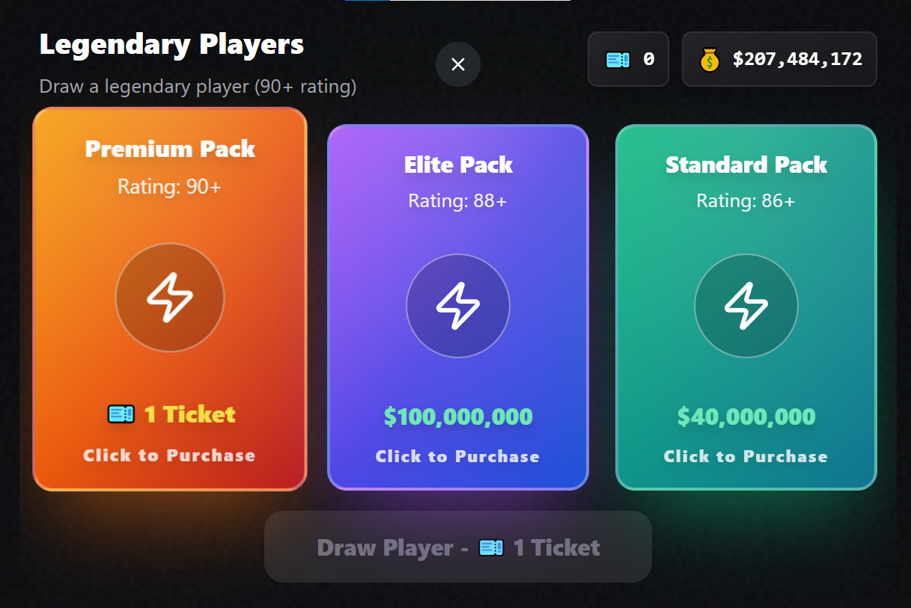
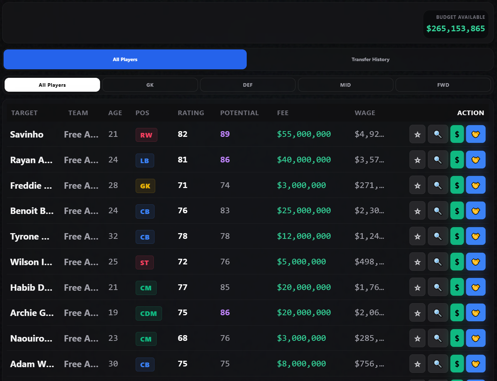

## Screenshots

### 1. Main Menu

The main hub of the game. All core sections such as squad management, financial operations, market, and transfers are accessible from this screen.

---

### 2. Squad Overview

Players can view detailed squad statistics, analyze performance data, and manage player transfers through buy and sell actions.

---

### 3. Financial Management

This screen allows control over club finances, including adjusting ticket prices, jersey prices, and managing overall income and expenses.

---

### 4. Market / Pack Opening

A market system inspired by pack-opening mechanics, where players can unlock content and resources through randomized packages.

---

### 5. Transfer Market

A dedicated transfer market where players can search, negotiate, and complete transfers to strengthen their squad.
